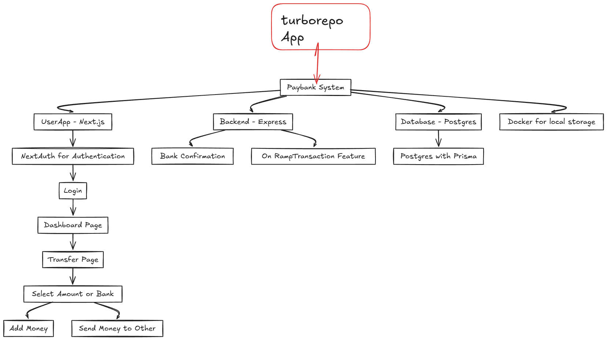

## Paybank

It is basic payment app where we can add money and transfer money by bank webhooks with help of rampTransactions



## Stack

Frontend and Backend - Next.js (or Backend)
Express - Auxilary backends
Turborepo
Postgres Database
Prisma ORM
Tailwind
Docker

## Sreenshots


# Turborepo starter

This is an official starter Turborepo.

## Using this example

Run the following command:

```sh
npx create-turbo@latest
```

## Run Locally Clone it

- git clone https://github.com/Anantdadhich/PAYTM.git

- npm install

- npm run dev

for user-app=>

- cd/apps/user-app

- npm run dev

## What's inside?

This Turborepo includes the following packages/apps:
